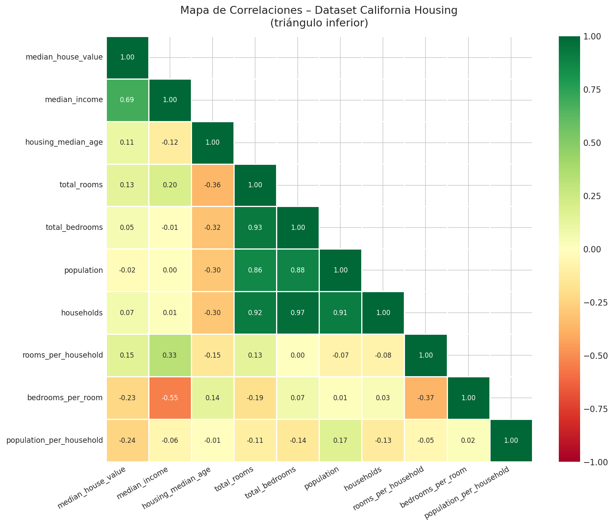
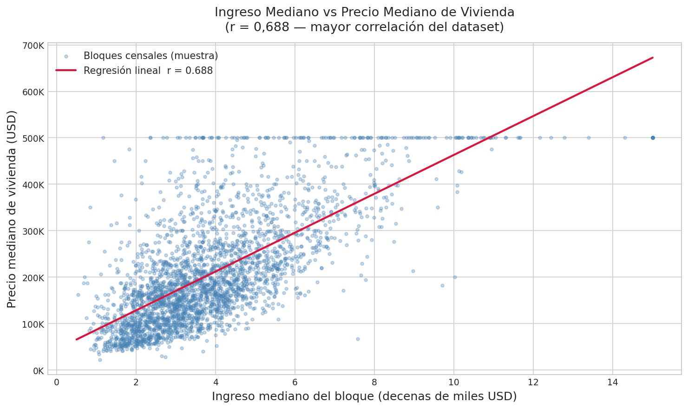
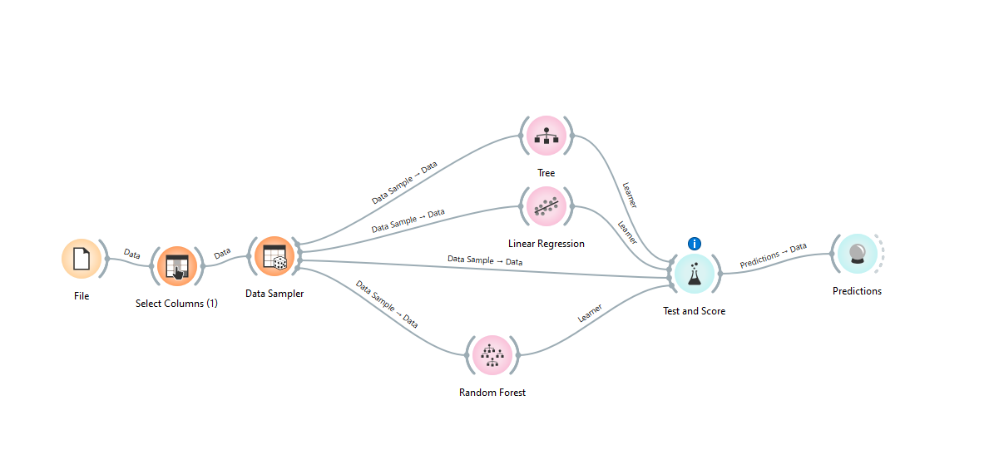
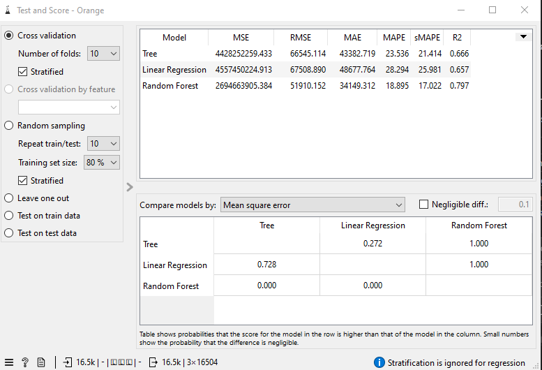
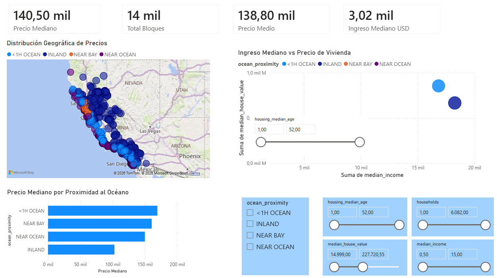
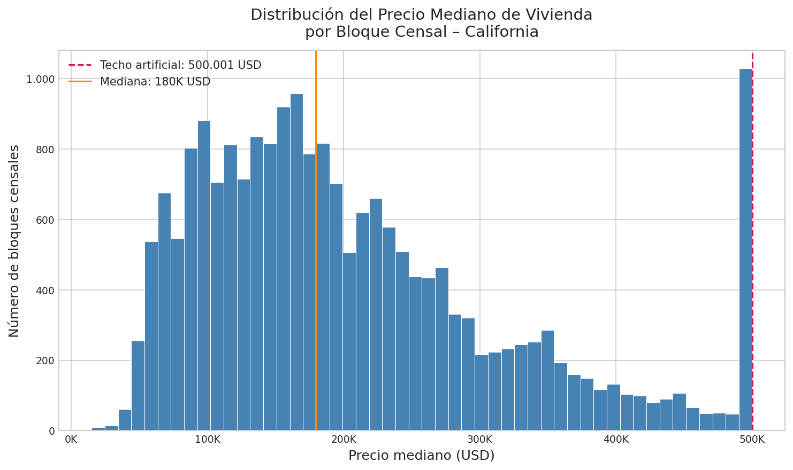
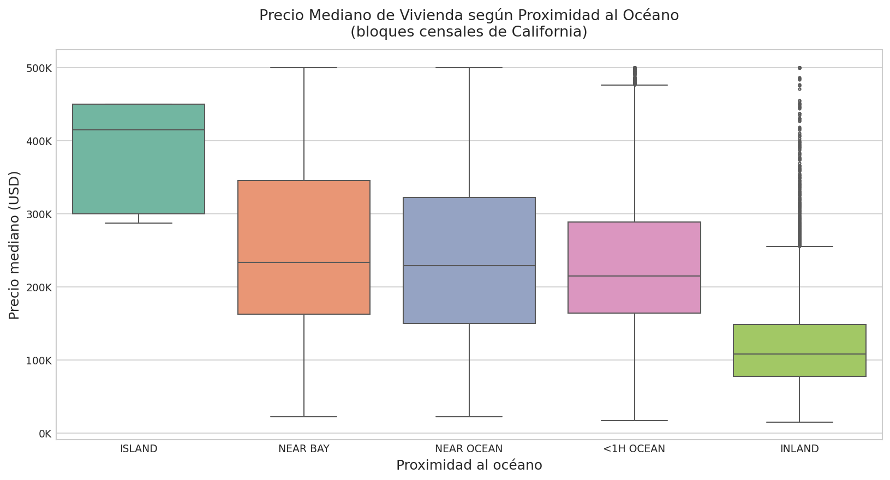
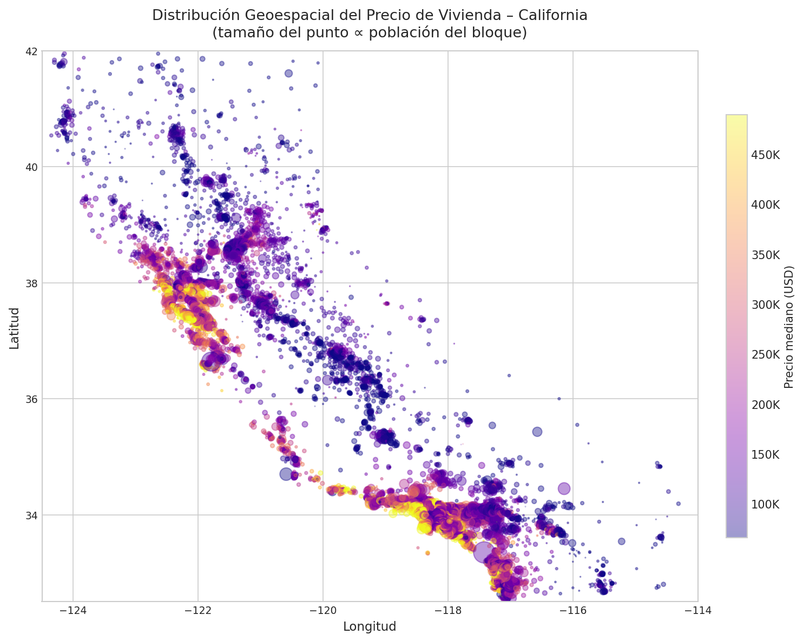

# California Housing Price Analysis


---

## Table of Contents

- [Abstract](#abstract)
- [Introduction](#introduction)
- [Development](#development)
  - [Tools](#tools)
  - [Phase 1 — Business Understanding](#phase-1--business-understanding)
  - [Phase 2 — Data Understanding](#phase-2--data-understanding)
  - [Phase 3 — Data Preparation](#phase-3--data-preparation)
  - [Phase 4 — Modeling](#phase-4--modeling)
  - [Phase 5 — Evaluation](#phase-5--evaluation)
  - [Phase 6 — Deployment](#phase-6--deployment)
- [Results](#results)
- [Conclusions](#conclusions)
- [Bibliography](#bibliography)
- [Project Structure](#project-structure)

---

## Abstract

Analysis of the California Housing dataset (1990 census) applying the CRISP-DM methodology. The dataset contains data from 20,640 census block groups across California, including socioeconomic, demographic, and geographic variables. The goal is to determine which factors drive median housing prices at the census block level. Python is used for exploratory analysis and data cleaning, Orange Data Mining for supervised modeling, and Power BI for visualization. Median block income is the strongest predictor (r = 0.688), and the Random Forest model achieves an R² of 0.797 in 10-fold cross-validation.

---

## Introduction

California's real estate market has faced decades of tension between supply and demand, with prices varying enormously by location. Studying the factors behind those differences is useful for both economic analysis and urban planning or investment decisions.

The dataset comes from the 1990 California census and was published by Pace, R. Kelley and Ronald Barry (1997). Each row represents a **census block group** — the smallest geographic unit of the US census — not an individual dwelling. This has important implications: `total_rooms`, `total_bedrooms`, `population`, and `households` are block-level totals, not per-household figures.

**Dataset variables:**

| Variable               | Description                                              |
|------------------------|----------------------------------------------------------|
| `longitude`            | Geographic longitude of the census block                 |
| `latitude`             | Geographic latitude of the census block                  |
| `housing_median_age`   | Median age of housing units in the block (years)         |
| `total_rooms`          | Total number of rooms in the census block                |
| `total_bedrooms`       | Total number of bedrooms in the block (207 nulls)        |
| `population`           | Total population of the census block                     |
| `households`           | Number of households in the census block                 |
| `median_income`        | Median block income (in tens of thousands of USD)        |
| `median_house_value`   | Median house value in USD — target variable              |
| `ocean_proximity`      | Proximity to the ocean (5 categories)                    |

Two dataset quirks affect the analysis: `median_income` is not in direct USD but in tens of thousands (a value of 3.87 equals $38,700), and `median_house_value` has an artificial ceiling at $500,001 imposed during census collection.

---

## Development

### Tools

| Tool                  | Use                                                              |
|-----------------------|------------------------------------------------------------------|
| Python 3.11           | Exploratory analysis, data cleaning, visualization, scaling      |
| Orange Data Mining    | Linear regression, decision tree, and Random Forest              |
| Power BI Desktop      | Interactive dashboard with maps, KPIs, and filters               |
| Docker / Compose      | Reproducible environment to run the analysis script              |

**Running the Python script:**

```bash
# With Docker
git clone <repo-url>
cd california-housing-analysis
docker-compose up --build

# Locally
cd python
pip install -r requirements.txt
python analisis.py
```

Charts are generated in `graficos/` and the processed CSV in `data/housing_clean.csv`.

---

### Phase 1 — Business Understanding

**Business question:** What socioeconomic, demographic, and geographic variables determine the median housing price in California census block groups?

**Analytical objective:** build regression models to estimate `median_house_value` from the remaining variables, and identify which of them have the greatest predictive power.

**Constraints identified upfront:**
- The dataset is from 1990; absolute prices are not extrapolable to the current market, but relational patterns remain valid as an analytical exercise.
- The target variable has an artificial ceiling at $500,001 that must be accounted for during model evaluation.

---

### Phase 2 — Data Understanding

The dataset has **20,640 rows** and **10 columns** (9 numeric + 1 categorical).

**Initial exploration with Python:**

```python
df.shape        # (20640, 10)
df.dtypes       # float64 x9, object x1
df.isnull().sum()
# total_bedrooms    207  ← only field with nulls (1.0% of total)
```

**Relevant distributions:**
- `median_house_value` shows moderate positive skew with an artificial spike at $500,001.
- `median_income` follows an approximately log-normal distribution, which explains its high correlation with price.
- `population` and `total_rooms` show very long tails with extreme values (max. 35,682 people in a block).

**Key finding:** strong multicollinearity exists between `total_rooms`, `total_bedrooms`, `households`, and `population` — all measure block size. Per-household derived variables are more informative.

| Correlation heatmap | Income vs. price scatter |
|---|---|
|  |  |

---

### Phase 3 — Data Preparation

Transformations were applied in this order inside `python/analisis.py`:

1. **Null imputation** — the 207 missing values in `total_bedrooms` were replaced with the median (433.0). The median was chosen over the mean due to outliers in that variable.

2. **Derived variable creation:**
   ```python
   df['rooms_per_household']      = df['total_rooms']    / df['households']
   df['bedrooms_per_room']        = df['total_bedrooms'] / df['total_rooms']
   df['population_per_household'] = df['population']     / df['households']
   ```

3. **Extreme outlier removal** — blocks with `population_per_household` > 6 were filtered out (institutional blocks or data errors, less than 0.5% of the total).

4. **One-hot encoding** of `ocean_proximity` (5 categories → 4 dummy columns, one dropped to avoid perfect multicollinearity).

5. **Z-score standardization** of continuous numeric variables for the linear regression model:
   ```python
   from sklearn.preprocessing import StandardScaler
   scaler = StandardScaler()
   df_scaled = scaler.fit_transform(df_numeric)
   ```

The clean dataset was exported to `data/housing_clean.csv` (20,422 rows after removing extreme outliers).

---

### Phase 4 — Modeling

An Orange Data Mining workflow was built with three models evaluated using **stratified 10-fold cross-validation**:

- **Linear regression** — baseline model, assumes a linear relationship between predictors and the target.
- **Regression tree** — captures non-linear relationships; maximum depth limited to 7 to avoid overfitting.
- **Random Forest** — ensemble of 100 trees with random feature sampling at each node; `min_samples_leaf = 5`.



---

### Phase 5 — Evaluation

| Model              | R²        | RMSE (USD) | MAE (USD) |
|--------------------|-----------|------------|-----------|
| Linear regression  | 0.657     | 67,509     | 48,678    |
| Regression tree    | 0.666     | 66,545     | 43,383    |
| Random Forest      | **0.797** | **51,910** | **34,149**|



**Interpretation:**
- The R² jump from linear regression (0.657) to Random Forest (0.797) indicates relevant non-linear relationships that regression cannot capture.
- A MAE of $34,149 on prices ranging from $15,000 to $500,001 represents a mean error of ~7%, acceptable for 1990 data without external variables such as interest rates or crime indices.
- The gap between a single tree and Random Forest confirms the benefit of ensembling: variance decreases by averaging 100 trees.

---

### Phase 6 — Deployment

The final project deliverables are:

| Deliverable                           | Description                                              |
|---------------------------------------|----------------------------------------------------------|
| `data/housing_clean.csv`              | Clean dataset ready for reuse                            |
| `graficos/*.png`                      | 5 exploratory analysis charts generated by Python        |
| `orange/orange_bigdata.ows`           | Reproducible Orange workflow with the three models       |
| `powerbi/ProyectoHousingBigData.pbix` | Interactive dashboard with maps, KPIs, and filters       |
| `docker-compose.yml`                  | Reproducible environment to run the script               |



---

## Results

### Correlations with price

| Variable                   | Pearson r   |
|----------------------------|-------------|
| `median_income`            | **+0.688**  |
| `rooms_per_household`      | +0.151      |
| `housing_median_age`       | +0.106      |
| `bedrooms_per_room`        | -0.259      |
| `population_per_household` | -0.023      |

### Median price by ocean proximity

| Category    | Median price (USD) |
|-------------|-------------------|
| ISLAND      | ~380,000          |
| NEAR BAY    | ~258,000          |
| NEAR OCEAN  | ~243,000          |
| <1H OCEAN   | ~240,000          |
| INLAND      | ~119,000          |

| Price distribution | Price by ocean proximity |
|---|---|
|  |  |

### Model comparison (10-fold CV, Orange Data Mining)

| Model              | R²        | RMSE (USD) | MAE (USD) |
|--------------------|-----------|------------|-----------|
| Linear regression  | 0.657     | 67,509     | 48,678    |
| Regression tree    | 0.666     | 66,545     | 43,383    |
| Random Forest      | **0.797** | **51,910** | **34,149**|

---

## Conclusions

1. **Block income is the single strongest driver of housing prices.** With a correlation of r = 0.688, `median_income` alone explains more variance in price than all other variables combined. Economic inequality is directly reflected in the housing market.

2. **Proximity to the ocean commands a premium.** `ISLAND` and `NEAR BAY` blocks have median prices more than three times higher than inland (`INLAND`) blocks. Geographic location introduces a premium that socioeconomic variables alone cannot capture.

3. **The $500,001 ceiling distorts the upper end of the distribution.** Around 7% of blocks hit that artificial maximum, compressing the right tail and potentially biasing regression models upward in that range.

4. **Block-size variables are multicollinear.** `total_rooms`, `total_bedrooms`, `households`, and `population` carry heavily overlapping information. Per-household derived variables (`rooms_per_household`, `bedrooms_per_room`) are more informative because they normalize that redundancy.

5. **High prices cluster geographically.** The map shows clear clusters in the San Francisco Bay Area and the Los Angeles basin, confirming that latitude and longitude are useful predictors and that spatial models could improve on the results obtained.



---

## Bibliography

### Academic and technical sources

- Pace, R. Kelley & Ronald Barry (1997). *Sparse Spatial Autoregressions*. Statistics & Probability Letters, 33(3), 291-297.
- Géron, A. (2022). *Hands-On Machine Learning with Scikit-Learn, Keras, and TensorFlow* (3rd ed.). O'Reilly Media.
- Chapman, P. et al. (2000). *CRISP-DM 1.0: Step-by-step data mining guide*. SPSS Inc.
- McKinney, W. (2022). *Python for Data Analysis* (3rd ed.). O'Reilly Media.
- Demšar, J. et al. (2013). *Orange: Data Mining Toolbox in Python*. Journal of Machine Learning Research, 14, 2349-2353.

### Data sources and documentation

- Kaggle California Housing Prices Dataset. CC0 Public Domain License. [https://www.kaggle.com/datasets/camnugent/california-housing-prices](https://www.kaggle.com/datasets/camnugent/california-housing-prices)
- Microsoft (2024). *Power BI documentation*. [https://learn.microsoft.com/power-bi/](https://learn.microsoft.com/power-bi/)

### AI tools used

Generative AI tools were used as support during this project for the following tasks:

| Tool               | Use                                                                              |
|--------------------|----------------------------------------------------------------------------------|
| Claude (Anthropic) | Assistance with Python code review, structuring, and documentation               |

The use of these tools was limited to coding support, quality review, and documentation organization. All analysis, methodological decisions, and conclusions are the author's own.

---

## Project Structure

```
california-housing-analysis/
├── data/
│   ├── housing.csv                  ← original dataset (CC0)
│   └── housing_clean.csv            ← generated by analisis.py
├── graficos/
│   ├── 01_histograma_precios.png
│   ├── 02_scatter_ingresos_precio.png
│   ├── 03_boxplot_ocean_proximity.png
│   ├── 04_heatmap_correlaciones.png
│   └── 05_mapa_geoespacial.png
├── python/
│   ├── analisis.py
│   ├── requirements.txt
│   └── Dockerfile
├── orange/
│   ├── orange_bigdata.ows
│   ├── orange_workflow.png
│   └── orange_results.png
├── powerbi/
│   ├── ProyectoHousingBigData.pbix
│   └── PowerBI_Dashboard.png
├── docs/
│   └── README_docs.md
├── docker-compose.yml
└── README.md
```
